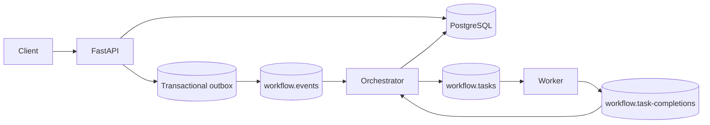
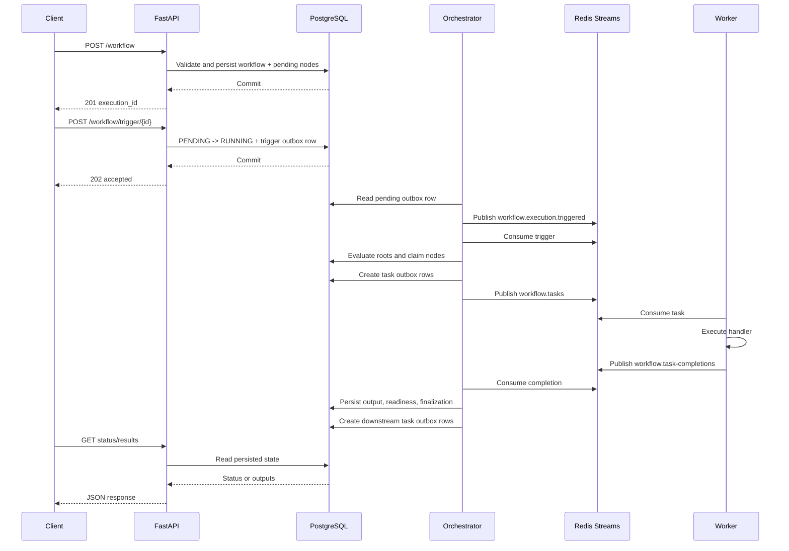

# Design decisions

This document records the important implementation decisions in the workflow
engine. It describes the behavior that exists in the repository, including
the guarantees and limitations that follow from those choices.

## System boundary

The system accepts JSON workflow definitions, validates them as directed
acyclic graphs, persists an execution, and runs eligible nodes asynchronously.
The application is split into three independently runnable roles:

- **FastAPI** accepts workflow definitions, triggers pending executions, and
  reads persisted status and results.
- **Orchestrator** evaluates dependency readiness, dispatches tasks, processes
  worker completion events, applies retries, and finalizes workflows.
- **Worker** consumes node tasks, selects a registered handler, executes it, and
  publishes a terminal completion event.

PostgreSQL is the authoritative store for workflow definitions, execution and
node state, JSON inputs and outputs, retry attempts, task-processing state, and
outbox records. Redis Streams is only the asynchronous transport. Redis does
not contain canonical workflow state.

The repository's supplied workflow example (`docs/executor_sample_payload.pdf`)
uses `POST /workflows`, while the challenge specification defines
`POST /workflow` and the implementation follows the singular endpoint. The
example should therefore be treated as payload guidance; its route must be
adjusted when using it with this API.



The API, Orchestrator, and Worker can be scaled separately. API replicas are
stateless HTTP processes. Orchestrator replicas share PostgreSQL and Redis
consumer groups and coordinate through persisted state and database locking.
Worker replicas share the worker consumer group and compete for tasks. The
database and Redis initialization jobs run before application services in
Compose.

## Workflow definition and DAG construction

A submission contains:

```json
{
  "name": "document-enrichment",
  "dag": {
    "nodes": [
      {
        "id": "input",
        "handler": "input",
        "dependencies": [],
        "config": {}
      },
      {
        "id": "fetch",
        "handler": "call_external_service",
        "dependencies": ["input"],
        "config": {
          "url": "https://example.test/{{ input.document_id }}"
        }
      }
    ]
  },
  "created_by": "client"
}
```

`WorkflowNode` contains an identifier, handler name, dependency identifiers,
and handler configuration. A trigger supplies JSON input separately; this
input is stored on the execution and is available to the `input` handler and
template resolution.

Before persistence, `WorkflowDefinitionService` runs the configured validation
rules:

- required workflow and node fields;
- valid node identifier syntax and unique identifiers;
- supported handlers and handler-specific configuration;
- dependency references that point to existing nodes; and
- directed-cycle detection.

Validation errors are aggregated and returned by the API before a workflow or
execution is created. The cycle rule uses an iterative depth-first traversal
with an active traversal set and reports a cycle path. This prevents malformed
or cyclic graphs from entering the asynchronous execution system.

After validation, `DAG.from_workflow` builds an internal lookup structure. Each
`DAGNode` stores immutable node configuration, dependencies, and reverse
dependants. The graph also records:

- **root nodes**: nodes with no dependencies;
- **terminal nodes**: nodes with no dependants;
- dependency lookup for input/readiness checks; and
- dependant lookup for failure propagation and downstream traversal.

The persisted workflow remains the JSON-friendly domain model. The internal
DAG is a traversal representation and is rebuilt from the validated workflow
when needed.

## Execution lifecycle

Submission and execution are deliberately separate:

1. `POST /workflow` validates the definition and persists the workflow,
   pending execution, and one pending `node_execution` row per node.
2. `POST /workflow/trigger/{execution_id}` accepts only a pending execution,
   atomically stores trigger input, changes the execution to `running`, and
   creates a `workflow.execution.triggered` outbox message.
3. The API returns `202 Accepted` after the database transaction commits. It
   acknowledges receipt, not completion.
4. The Orchestrator publishes the outbox message to `workflow.events`, consumes
   it through the `orchestrator` group, and evaluates initial readiness.
5. Root nodes are promoted from `pending` to `running`, their inputs are
   resolved, and task messages are placed in the outbox for
   `workflow.tasks`.
6. The Worker consumes tasks through the `workers` group, deserializes the flat
   Redis fields, selects a handler, executes it, and publishes a completion to
   `workflow.task-completions`.
7. The Orchestrator consumes completions through the
   `orchestrator-completions` group. In one PostgreSQL transaction it persists
   the node result or failure, applies retry/failure logic, evaluates newly
   ready nodes, and evaluates workflow finalization.
8. Ready nodes are dispatched after the completion transaction. The task
   outbox makes the state change and eventual task publication durable.
9. `GET /workflows/{execution_id}` reads current persisted execution and node
   state.
10. `GET /workflows/{execution_id}/results` returns persisted node outputs only
    for a successfully completed execution.



## Readiness, fan-out, and fan-in

Readiness is calculated from persisted node statuses. A node is eligible when
it is still `pending` and every declared dependency is `completed`. Nodes that
are `running`, `completed`, or `failed` are not eligible again.

For this graph:

```text
    A
   / \
  B   C
   \ /
    D
```

`A` is a root and is dispatched immediately. Once it completes, both `B` and
`C` satisfy their dependency requirement and are dispatched independently.
`D` is not ready after only one branch completes; it becomes ready only after
both `B` and `C` are persisted as completed.

This same rule supports:

- multiple roots, which can be dispatched in parallel;
- fan-out, where one completion makes several dependants eligible;
- fan-in, where all required parents must complete;
- multiple terminal nodes, each of which contributes to finalization; and
- uneven branch depths, because readiness is based on dependency state rather
  than graph level or elapsed time.

Dispatching uses independent transactions for a batch of ready nodes. Each
node is atomically claimed with a conditional PostgreSQL update from
`pending` to `running`. If another Orchestrator has already claimed the node,
the second dispatch becomes an `already_started` result and does not publish a
second logical task.

## State and concurrency

Workflow execution states are:

```text
PENDING -> RUNNING -> COMPLETED
                  \-> FAILED
```

Node execution states are:

```text
PENDING -> RUNNING -> COMPLETED
                  \-> FAILED
PENDING ----------------> FAILED  (failed dependency)
```

`COMPLETED` and `FAILED` are terminal states for both state machines. Updates
use conditional `UPDATE ... WHERE status = expected_status` operations, so a
stale event cannot move a terminal record backwards or apply the same
transition twice.

### Concurrent fan-in

Completion processing locks the workflow execution row with PostgreSQL
`SELECT ... FOR UPDATE` for the duration of its unit-of-work transaction. This
serializes completion processing for one execution while allowing unrelated
executions to proceed concurrently.

For the diamond graph, if `B` and `C` complete at the same time:

1. One completion transaction obtains the execution lock and records its
   parent output.
2. The other completion waits for that lock.
3. The first transaction evaluates readiness. `D` remains pending until both
   parent states are visible.
4. The second transaction obtains the lock, records the other parent, and
   evaluates readiness with both parents completed.
5. Only one transaction can successfully claim `D` with the conditional
   pending-to-running update.

The guarantee is exactly one **logical** dispatch claim for `D`. Redis can
still contain duplicate physical messages because transport and publisher
crashes are handled with at-least-once semantics. Worker idempotency prevents
those messages from executing the logical task more than once under normal
recovery paths.

Duplicate completion events for already-terminal nodes are treated as
idempotent no-ops. They do not re-persist outputs, re-promote dependants, or
change workflow state.

## Data passing and template resolution

Node outputs are stored as JSONB in the node execution record. Before a task is
published, the Orchestrator aggregates:

- trigger input for the `input` handler; and
- completed dependency outputs keyed by dependency node ID for downstream
  handlers.

Templates use expressions such as:

```text
{{ fetch.status }}
{{ fetch.payload.document.title }}
{{ fetch.items.0.id }}
```

The parser accepts node identifiers and dot-separated object keys or numeric
list indexes. It rejects unmatched delimiters, malformed expressions,
unavailable dependency outputs, missing object keys, and invalid list indexes.

A string containing exactly one template reference preserves the referenced
JSON value's type. For example, `{{ fetch.metadata }}` can resolve to an
object or array. Embedded references are interpolated into strings and must
resolve to scalar JSON values; booleans and null are rendered as `true`/`false`
and `null`.

The `output` handler receives the dependency-output mapping, allowing a
terminal node to aggregate fan-in results. The results endpoint then returns
node-level provenance and persisted `output_data`; it does not recompute
handlers or templates.

## Worker execution

Workers consume `workflow.tasks` with the `workers` Redis consumer group. Each
task contains:

- deterministic logical `task_id`;
- unique `attempt_id` and attempt number;
- execution and node identifiers;
- handler name and JSON handler configuration; and
- resolved JSON input.

The handler registry currently contains `input`, `output`,
`integration_barrier`, `call_external_service`, and `llm_service`
implementations. The external-service and LLM handlers are mocks: they
simulate latency/failure and return deterministic data rather than making
external calls.

Worker instances use bounded in-process concurrency. A task is acknowledged
only after its completion event has been published and task-processing state
has been persisted. Malformed messages with recoverable identity produce a
failure completion event. Messages without enough identity for correlation are
written to `workflow.task-dead-letter` before acknowledgement.

The Worker does not evaluate workflow dependencies. It executes one task and
reports one terminal outcome; all dependency and workflow decisions remain in
the Orchestrator and PostgreSQL.

## Reliability and failure handling

### At-least-once delivery and idempotency

Redis Streams consumer groups provide at-least-once delivery. A message can be
redelivered when a process exits before acknowledgement, or when a publisher
retries after an uncertain result.

The logical task ID is deterministic:

```text
UUID5(namespace, "{execution_id}:{node_id}")
```

Worker processing state is persisted in PostgreSQL. A uniqueness constraint
and atomic claim prevent concurrent Worker processes from executing the same
logical task simultaneously. A completed duplicate delivery replays the
persisted result event and is acknowledged without invoking the handler again.

This is exactly-once logical processing for the persisted task state, not an
absolute exactly-once guarantee for arbitrary external side effects. A handler
that performs an external side effect would need its own idempotency key or
transactional integration. The current external and LLM handlers are mocks.

### Retries

Failed task attempts are persisted separately from the node lifecycle. The
default policy allows three total attempts with one-second initial delay and a
backoff multiplier of two. The policy is configurable with:

- `WORKFLOW_TASK_MAX_ATTEMPTS`;
- `WORKFLOW_TASK_RETRY_INITIAL_DELAY_SECONDS`;
- `WORKFLOW_TASK_RETRY_BACKOFF_MULTIPLIER`; and
- `WORKFLOW_TASK_RETRY_MAX_DELAY_SECONDS`.

Every attempt has its own stable `attempt_id` and attempt number. Due retries
are published by the Orchestrator and marked as published in PostgreSQL.
Duplicate failure events for the same attempt do not schedule another retry.
Once the retry limit is exhausted, the node becomes failed.

### Failure propagation

Any failed node causes the workflow execution to become `failed`. Pending
dependants that can no longer run are marked failed with a
`FailedDependency` error. A failed dependency therefore cannot leave
downstream nodes waiting indefinitely, and failed workflows never expose final
results.

### Interrupted workers

Workers use Redis `XAUTOCLAIM` to reclaim pending task messages after a
configurable idle period. PostgreSQL task-attempt claims have a shorter lease
that is renewed while a handler runs. This prevents a healthy long-running
task from being reclaimed while allowing another Worker to recover work after
process interruption.

Shutdown stops new intake and waits for in-flight work for a bounded period;
remaining unacknowledged messages are recoverable through the pending-message
mechanism. A production drain-first shutdown policy would provide a smoother
handoff than the current coding-test behavior.

## Transactional outbox

PostgreSQL and Redis cannot participate in one atomic transaction. Without an
outbox, the Orchestrator could commit `node D = running` and then crash before
publishing D's task, leaving durable state that has no corresponding message.

The implementation writes the state transition and its outbound message to
`outbox_events` in the same PostgreSQL transaction. The Orchestrator
periodically:

1. selects pending rows with `FOR UPDATE SKIP LOCKED`;
2. publishes their stable message IDs and payloads to the target stream;
3. marks successful rows as published; and
4. retains published rows for a configurable period before cleanup.

Multiple publisher processes can safely work concurrently because locked rows
are skipped. If Redis is unavailable, the row remains pending, records the
publication error, and is retried on a later poll.

If a publisher crashes after Redis accepts a message but before PostgreSQL
commits the published status, the row is published again. This is an expected
duplicate, not a lost message. Stable event/task identity and idempotent
consumers make the recovery safe. The outbox therefore provides durable
eventual publication, not exactly-once physical delivery.

The outbox is used for trigger events, task messages, node lifecycle events,
and workflow lifecycle events. Worker completion events are published directly
to their dedicated completion stream after worker result state is recorded;
the Orchestrator persists their workflow effects transactionally when it
consumes them.

## Deployment and scaling

Compose defines:

- `api`: FastAPI/Uvicorn HTTP service;
- `orchestrator`: outbox publisher and Redis consumer service;
- `worker`: Redis task consumer and handler runtime;
- `migrate`: one-shot Alembic migration job;
- `redis-init`: one-shot stream and consumer-group initialization job;
- `postgres`: PostgreSQL 16.10 with a named data volume; and
- `redis`: Redis 7.4 with health checks.

Services use environment-provided `DATABASE_URL`, `MIGRATE_DATABASE_URL`, and
`REDIS_URL`. Compose service names provide network discovery. API, Orchestrator,
and Worker wait for the relevant initialization jobs and health checks.

API and Worker replicas can be scaled independently. Orchestrator replicas
also coordinate through consumer groups and PostgreSQL locking, but throughput
is ultimately bounded by database contention, Redis consumer lag, and the
single-execution completion lock. Redis is configured without AOF persistence
in the supplied Compose file, so PostgreSQL/outbox recovery is the durable
recovery mechanism for application state and outbound messages.

## Testing decisions

The repository separates tests by boundary:

| Directory            | Purpose                                                                                 |
| -------------------- | --------------------------------------------------------------------------------------- |
| `tests/unit/`        | Logic without PostgreSQL, Redis, or Docker                                              |
| `tests/integration/` | Real PostgreSQL and Redis, process boundaries, orchestration, concurrency, and recovery |
| `tests/load/`        | Intended location for throughput, contention, and breaking-point tests                  |
| `tests/docker/`      | End-to-end validation of the actual Compose topology                                    |

The repository currently contains unit, integration, and Docker suites; a
`tests/load/` suite is not currently present.

Integration tests select infrastructure as follows:

- when both `DATABASE_URL` and `REDIS_URL` are supplied, tests use those
  externally managed services, as in GitHub Actions;
- when neither is supplied, tests start disposable PostgreSQL and Redis
  Testcontainers; and
- a partially supplied configuration is not accepted as an external setup.

Important scenarios covered by the implemented tests include linear execution,
dependency orchestration, fan-out/fan-in, the concurrent diamond fan-in race,
duplicate task delivery, worker task idempotency, retry and failure behavior,
application restart, Worker recovery, and scaled Compose execution.

## Decision summary and trade-offs

| Decision                                     | Problem addressed                                                            | Benefit                                                              | Trade-off                                                               |
| -------------------------------------------- | ---------------------------------------------------------------------------- | -------------------------------------------------------------------- | ----------------------------------------------------------------------- |
| PostgreSQL is the source of truth            | Distributed processes need durable shared state                              | Queries, locks, recovery, and results have one authority             | Database latency and lock contention bound throughput                   |
| Redis Streams is transport only              | Services need asynchronous decoupling                                        | Consumer groups, pending messages, and `XAUTOCLAIM` support recovery | Delivery is at least once and requires idempotent consumers             |
| Separate API, Orchestrator, and Worker roles | HTTP intake, graph coordination, and task execution have different workloads | Each role scales and fails independently                             | More process boundaries and operational coordination                    |
| Persisted execution state                    | Process-local state is lost during restart or scaling                        | Any replica can resume from PostgreSQL                               | More database reads and writes                                          |
| Conditional updates and execution-row locks  | Concurrent dispatch and fan-in can race                                      | One logical node claim and one consistent fan-in decision            | Completion for one execution is serialized                              |
| Deterministic task IDs                       | Duplicate messages must identify one logical task                            | Stable correlation and idempotency keys                              | A node can have only one logical task per execution                     |
| Transactional outbox                         | PostgreSQL and Redis cannot share an atomic commit                           | Prevents committed state transitions from losing messages            | Publication is asynchronous and may duplicate physical messages         |
| Configurable retries                         | Transient task failures should not immediately fail a workflow               | Backoff and durable attempts make retry behavior explicit            | Retries add latency and can amplify load                                |
| Immediate failure propagation                | Downstream nodes must not wait on impossible dependencies                    | Workflows reach a clear terminal failure state                       | Partial successful branch results are not exposed as final results      |
| Mock external handlers                       | The coding test needs deterministic, infrastructure-free handlers            | Repeatable tests without external credentials or services            | The system does not yet demonstrate real external side-effect semantics |

The resulting guarantees are intentionally scoped: durable persisted state,
at-least-once transport, exactly-once logical task claims, and idempotent
workflow progression. The design does not claim exactly-once execution of
arbitrary external effects or zero-loss behavior if PostgreSQL itself is
unavailable.
